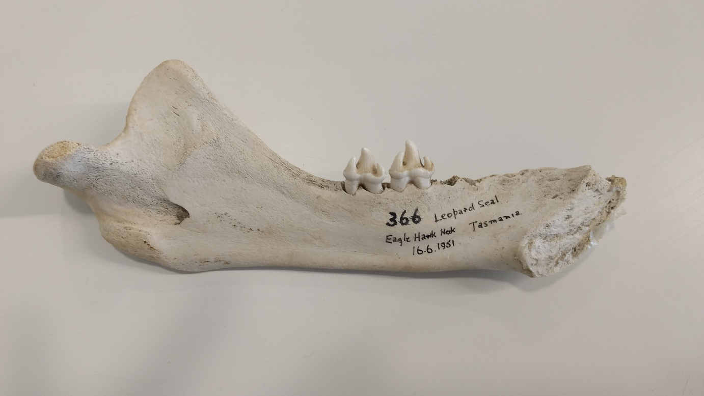
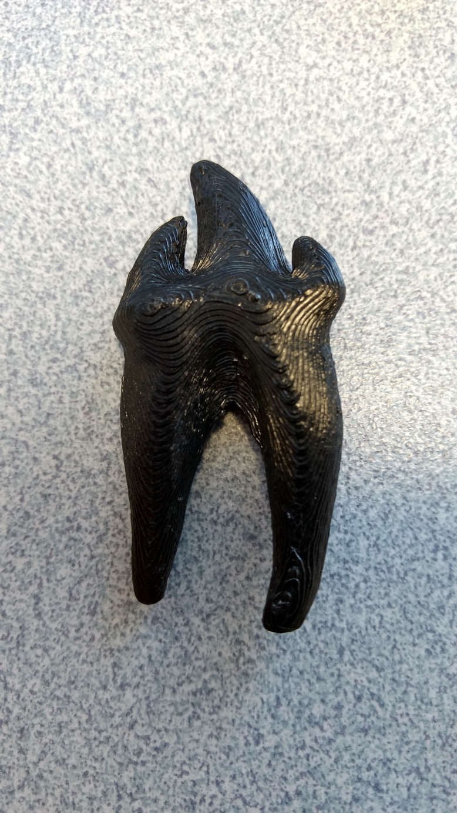

# Leopard seal tooth

Model reconstructed from a leopard seal jaw from Eaglehawk Neck, Tasmania, June 1951. Specimen 366 from the Institute of Antarctic Studies, University of Tasmania (Prof Mark Hindell).

